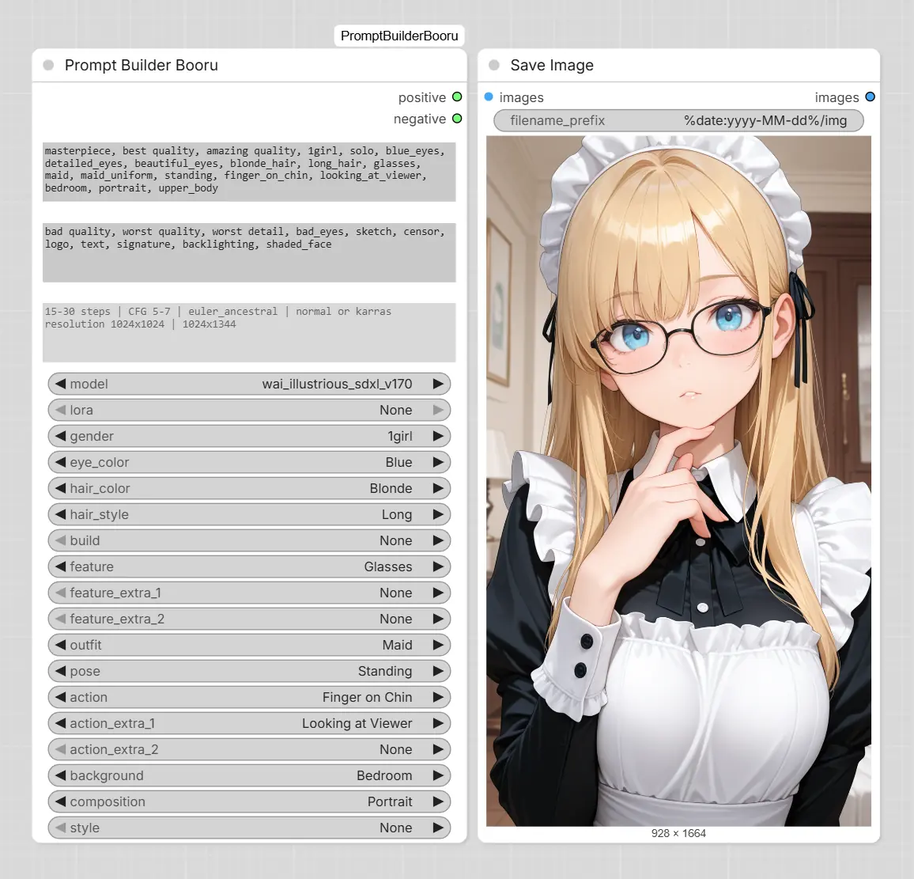

# ComfyUI-PromptBuilderBooru

A custom ComfyUI node for building Booru-style prompts with ease. Select tags from dropdowns, apply LoRA overrides, and generate positive/negative prompts automatically.



## Features

- **Booru-style prompt generation** - build prompts using structured Danbooru-style tags
- **LoRA support** - define overrides for gender, appearance, outfit, pose, action, background, and style
- **Positive & Negative prompts** - separate outputs for both
- **Model presets** - store recommended hints for each model
- **Automatic prompt assembly** - tags are combined in the correct Booru order
- **Customizable** - edit `presets.json` to add your own tags, models, and LoRAs

## Inputs

| Parameter | Description |
|-----------|-------------|
| `model` | Select the base model (positive / negative prompts, hints) |
| `lora` | Apply LoRA overrides (gender, appearance, outfit, etc.) |
| `gender` | `1girl` or `1boy` |
| `eye_color` | Eye color tag |
| `hair_color` | Hair color tag |
| `hair_style` | Hair style tag |
| `build` | Body type tag |
| `feature` | Main feature (freckles, blush, glasses, etc.) |
| `feature_extra_1` | Additional feature |
| `feature_extra_2` | Additional feature |
| `outfit` | Outfit type |
| `pose` | Pose tag |
| `action` | Main action (hand on hip, peace sign, etc.) |
| `action_extra_1` | Additional action |
| `action_extra_2` | Additional action |
| `background` | Background / environment tag |
| `style` | Art style tag |

## Outputs

| Output | Type | Description |
|--------|------|-------------|
| `positive` | STRING | Generated positive prompt |
| `negative` | STRING | Generated negative prompt |

## How It Works

### Prompt Assembly Order

1. **Model** - `positive` from the selected model
2. **Gender** - `1girl` or `1boy`
3. **Appearance** - eye color, hair color, hair style, build, features (combined)
4. **Outfit** - selected outfit tags
5. **Pose** - selected pose tag
6. **Action** - selected action tags (combined)
7. **Background** - selected background tag
8. **Style** - selected style tag

### LoRA Overrides

When a LoRA is selected, its `override` values replace the corresponding dropdown selections:

| Override Field | Replaces |
|----------------|----------|
| `gender` | `gender` dropdown |
| `appearance` | All appearance fields (eye_color, hair_color, hair_style, build, features) |
| `outfit` | `outfit` dropdown |
| `pose` | `pose` dropdown |
| `action` | `action` dropdown |
| `background` | `background` dropdown |
| `style` | `style` dropdown |

This allows LoRAs to override character details or just apply a style, while leaving other settings open for user customization.

### Installation

```bash
git clone https://github.com/RokuZero/ComfyUI-PromptBuilderBooru.git
